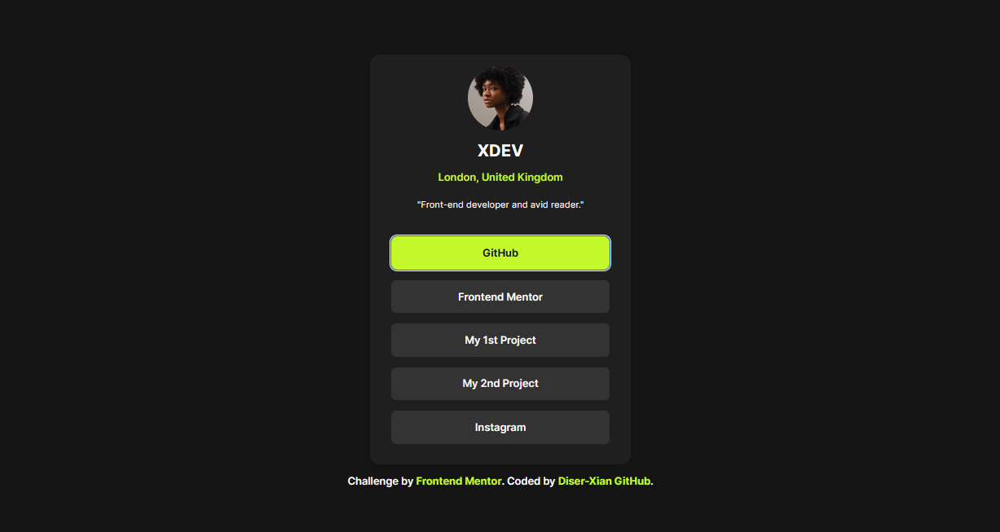

# Frontend Mentor - Social links profile solution

This is a solution to the [Social links profile challenge on Frontend Mentor](https://www.frontendmentor.io/challenges/social-links-profile-UG32l9m6dQ). Frontend Mentor challenges help you improve your coding skills by building realistic projects. 

## Table of contents

- [Overview](#overview)
  - [The challenge](#the-challenge)
  - [Screenshot](#screenshot)
  - [Links](#links)
- [My process](#my-process)
  - [Built with](#built-with)
  - [What I learned](#what-i-learned)
  - [Continued development](#continued-development)
  - [AI Collaboration](#ai-collaboration)
- [Author](#author)

## Overview

This is my 3rd challenge from frontend mentor, i was able finish this with a little bit of struggle, but in the js file I just vibe Coded it because i still dont know js that much, I Hope you understand and please like this repo

### The challenge

Users should be able to:

- See hover and focus states for all interactive elements on the page

### Screenshot

### Links

- Solution URL: [Solution](https://your-solution-url.com)
- Live Site URL: [Live Site](https://diser-xian.github.io/SociaLink_profile-Project/)

## My process
I started by structuring the layout using semantic HTML (<article>, <header>, <ul>, <li>). After that, I focused on styling with CSS, using Flexbox for alignment and CSS variables for consistent colors. Once the layout matched the design, I refined spacing, typography, and hover states. Finally, I improved accessibility by ensuring proper focus styles and keyboard navigation.

### Built with

- Semantic HTML5 markup
- CSS custom properties
- javascript

### What I learned
How to properly use semantic elements instead of relying on 

Applying CSS variables for cleaner and reusable styling
Improving accessibility using :focus and keyboard navigation
Structuring components like cards using <article> and <header>

### Continued development

Improve keyboard navigation (e.g., arrow key navigation for lists)
Learn more about accessibility (ARIA roles, better focus management)
Practice writing more scalable and maintainable CSS
Explore responsive design techniques for more complex layouts

### AI Collaboration
AI was used as a support tool to clarify concepts, debug issues, and optimize code structure. It helped explain semantic HTML usage, CSS behavior, and keyboard accessibility. The implementation and decisions were still manually reviewed and adjusted to ensure proper understanding.

## Author

- Website - [Diser Xian](https://www.your-site.com)
- Frontend Mentor - [@XDEV](https://www.frontendmentor.io/profile/yourusername)

